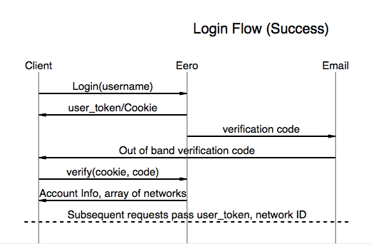

This is a quick proof of concept based on [this](https://community.eero.com/t/q5mhlh) discussion that was had in the Eero forum. Eero added the ability to see the instantaneous usage per device on the network. This code attempts to aggregate those usage stats so a monthly total usage can be attributed to each device and the overall network.

*PoC Goal*: Integrate the instantaneous usage metric to form cumulative usage metric that can be represented in multiple timeframes.

TODO:

[] Dump monitor info out console
[] Sanitize the API samples so they can be put in this repo
[] Create a Postman collection for accessing Eero more easily


## Eero Monitor


## Usage

* If you do not already have a session key you will need to generate one. This is a two step process:
	* Request verification code:
		* `eeroMonitor --loginID=[email@example.com]`
		* This returns a session key and causes Eero to send a verification code via email
	* Verify code to activate session key:
		* `eeroMonitor -verificationKey=123456 -sessionKey="6654321|232c2aoj93fvdes82eg99ase7e"`


* Once the session key is is verified pass that as `-sessionKey`


## Login Flow

Login to Eero is a two stage process:

1. Client sends their login id and Eero return a `hash` called a `user_token` and emails a verification code to the user.
2. Client sets the the `user_token` as a Cookie and POSTs the verification code

Once Eero verifies the `user_token` it is used in subsequent requests to access the account information.




## Some Eero API

Eero uses a REST API where the body of the requests and responses are formed in JSON. The API uses `Cookie: s=[USER_TOKEN]` in each of the requests for access control.

* *Host*: `api-user.e2ro.com`
* *User-Agent:* `eero-ios/2.16.0 (iPhone8,1; iOS 11.3)`

| Name  | URL  | Description  |
|:-:|---|---|
| Login  | `/2.2/login?`  | Returns [USER_TOKEN], Set Cooke, send email with verification code  |
|   | `/2.2/login/verify?`   | Returns meta information and list of networks  |
|   | `/2.2/logout?` | Presumable un-verifies the [USER_TOKEN] |
|  | `/2.2/log?` | |
|  | `/2.2/account?` | |
|  | `/2.2/networks/[NETWORK_ID]?` |  |
|  | `/2.2/networks/[NETWORK_ID]/support?` | |
|  | `/2.2/networks/[NETWORK_ID]/burst_reporters?` | |
|  | `/2.2/networks/[NETWORK_ID]?` | |
|  | `/2.2/networks/[NETWORK_ID]/devices?thread=true` | <-- **This is our target API here** |
|  | `/2.2/networks/[NETWORK_ID]/guestnetwork?` | |
|  | `/2.2/networks/[NETWORK_ID]/profiles?` | List of all devices and details about the device|
|  | `/2.2/networks/[NETWORK_ID]/devices/[DEVICE_ID]`| |


### Error Detection

It seems most responses from the Eero server has a meta dictionary that is used to determine the result of the API request. It seems to follow the HTTP status code.

```
"meta": {
    "code": 200,
    "server_time": "2020-09-21T23:00:01.123Z"
},
```
